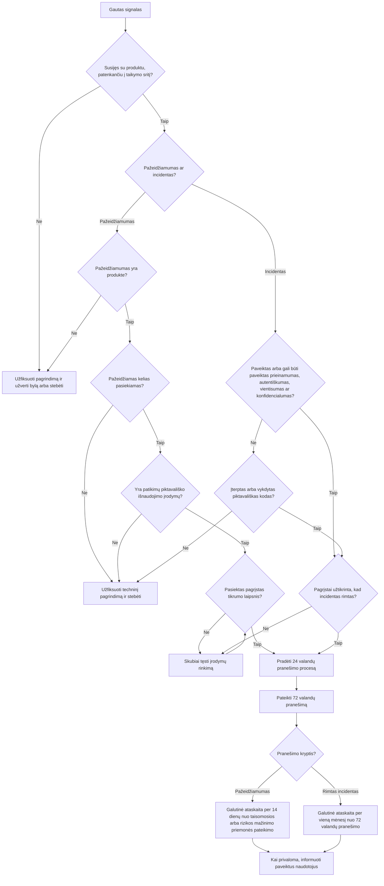

## Techninis scenarijus: kada pažeidžiamumo signalas tampa reguliaciniu klausimu

Situacija tokia: gamintojo PSIRT gauna signalą *(arba intel’į, jei taip paprasčiau)*, kad trečiosios šalies komponento pažeidžiamumas gali būti aktyviai išnaudojamas. Komponentas aptinkamas trijose palaikomose produkto versijose, dviejose senesnėse firmware šakose ir nuo cloud’o priklausančioje funkcijoje, kurią naudoja tik dalis diegimų. Viešai jau yra exploit kodas, internete suaktyvėjo pažeidžiamų sistemų paieška, o vienas klientas atsiuntė nepilnus logus su neįprastu child process paleidimu. Kitaip sakant, signalų jau ne vienas, bet automatinio atsakymo „reportinam“ vis dar nėra.

Čia jau neužtenka pasakyti „radom CVE, patchinam“. Gamintojas turi nustatyti, kuriuose produkto build’uose yra pažeidžiamas kodas, ar atitinkamas code path’as pasiekiamas ir atvertas, ar stebėta veikla iš tiesų yra piktavališkas jo produkto išnaudojimas ir kada turimų įrodymų pakanka pradėti skaičiuoti **CRA 14 straipsnyje** nustatytą pranešimo terminą.

Ir čia prasideda ta nepatogi pilkoji zona tarp techninio fakto ir teisinės ribos. Komponento atitiktis gali pradėti skubų triage, bet nebūtinai reiškia, kad gamintojas jau sužinojo apie praneštiną įvykį. Kita vertus, laukti, kol klientas atsiųs tobulą forensic paketą ir dar kas nors garsiai pasakys „taip, mus nulaužė“, irgi būtų per aukšta riba. Organizacijai reikia apginamo metodo konkretaus produkto išnaudojamumui, įrodymų kokybei ir tam awareness timestamp’ui, kai pasiekiamas **pagrįstas tikrumo laipsnis**, įvertinti. Nuo to momento iki pirmojo pranešimo lieka ne daugiau kaip 24 valandos *(laikrodis, deja, dėl savaitgalio nesustoja)*.

Nuo **2026 m. rugsėjo 11 d.** gamintojai privalės pranešti apie aktyviai išnaudojamus pažeidžiamumus, esančius produktuose su skaitmeniniais elementais, ir apie rimtus incidentus, darančius poveikį tokių produktų saugumui. Pranešimai teikiami pagal tvarką, apimančią paskirtą koordinuojančią reagavimo į kompiuterių saugumo incidentus tarnybą, ENISA ir bendrą pranešimų teikimo platformą (angl. *Single Reporting Platform*, SRP).

> Europos Komisijos gairės savaime nėra teisiškai privalomas teisės aktas. Jose pateikiamas Komisijos CRA aiškinimas ir praktinio taikymo pavyzdžiai, tačiau autoritetingą teisės akto išaiškinimą gali pateikti Europos Sąjungos Teisingumo Teismas.
{: .prompt-info }

## Ko iš tikrųjų reikalauja 14 straipsnis

Jei trumpai, 14 straipsnis turi du susijusius reporting track’us. Pirmasis – produkto pažeidžiamumas, kai gamintojas turi patikimų įrodymų, kad piktavalis jį išnaudojo be sistemos savininko leidimo. Antrasis – rimtas incidentas, darantis poveikį produkto saugumui.

| Pranešimo pagrindas | Techninė riba | Pagrindinis vertinimo klausimas |
| --- | --- | --- |
| **Aktyviai išnaudojamas pažeidžiamumas** | Patikimi įrodymai pagrindžia produkto pažeidžiamumo piktavališką išnaudojimą | Ar įrodymai susiję su šiame produkte pasiekiamu išnaudojimo keliu, o ne tik su platesne ekosistema? |
| **Rimtas incidentas, darantis poveikį produkto saugumui** | Įvykis paveikia arba gali paveikti prieinamumą, autentiškumą, vientisumą ar konfidencialumą arba yra susijęs su piktavališko kodo įterpimu ar vykdymu | Ar įvykis rimtas konkretaus produkto ir jo naudotojų kontekste? |
{: .hx-table-wide }

Aukštas CVSS balas, viešas PoC, įtraukimas į CISA KEV ar kitą išnaudojamų pažeidžiamumų katalogą, interneto skenavimas ir threat actor’iaus pareiškimai yra geri signalai skubiam tyrimui. Bet CVSS 10 nėra didelis raudonas mygtukas su užrašu **REPORT NOW**. Nė vienas iš šių signalų savaime neįrodo, kad konkretus gamintojo produktas turi pasiekiamą ir piktavališkai išnaudojamą pažeidžiamumą. Su leidimu ir good-faith principu atliekamas saugumo testavimas taip pat nėra tas pats, kas piktavališkas išnaudojimas.

Pranešimų terminai nustatyti teisės akte, todėl organizacija negali jų pakeisti kitaip pavadindama savo procesą. Operacinis skirtumas yra tai, kokius techninius įrodymus ji gali pateikti kiekviename etape.

| Pranešimo etapas | Aktyviai išnaudojamas pažeidžiamumas | Rimtas incidentas | Tikėtini vidiniai įrodymai |
| --- | --- | --- | --- |
| Ankstyvasis perspėjimas | Per 24 valandas nuo sužinojimo | Per 24 valandas nuo sužinojimo | Produkto tapatybė, pranešimo pagrindas, pirminė geografinė aprėptis ir kontaktiniai duomenys |
| Tolesnis pranešimas | Per 72 valandas nuo sužinojimo | Per 72 valandas nuo sužinojimo | Pirminė aprėptis, poveikis, rizikos mažinimo priemonės ir naudotojų veiksmai |
| Galutinė ataskaita | Per 14 dienų nuo taisomosios arba rizikos mažinimo priemonės pateikimo | Per vieną mėnesį nuo 72 valandų pranešimo | Pagrindinė priežastis, rimtumas, ištaisymas, likutinė rizika ir žinoma informacija apie grėsmę |
{: .hx-table-wide }

24 valandų ankstyvasis perspėjimas nėra vieta rašyti romaną ar apsimesti, kad tyrimas jau baigtas. Jame fiksuojama pradinė patikrinta pozicija, kol techninis darbas tęsiasi. Ko dar nežinom, tą taip ir pažymim – **nežinoma**. Geriau tvarkingas unknown negu gražiai skambanti prielaida, kuri po dviejų valandų subyra.

## Operacinė laiko seka nuo signalo iki galutinės ataskaitos

Praktiškai naudinga laiko seka prasideda nuo įrodymų, o ne nuo bendro CRA datų sąrašo.

| Operacinis momentas | Reguliacinė reikšmė | Būtinas vidinis gebėjimas |
| --- | --- | --- |
| Gautas signalas | Pranešimo terminas nebūtinai jau pradėtas skaičiuoti | Priėmimas, bylos sukūrimas ir įrodymų išsaugojimas |
| Pradinis vertinimas | Vertinama sąsaja su produktu ir įrodymų kokybė | PSIRT, CTI ir inžinerijos pirminis vertinimas |
| Pasiektas pagrįstas tikrumas | Pradedamas skaičiuoti 14 straipsnio pranešimo terminas | Oficialus laiko žymos fiksavimas ir reguliacinė eskalacija |
| Per 24 valandas | Turi būti pateiktas ankstyvasis perspėjimas | Minimalus patikrintos informacijos paketas |
| Per 72 valandas | Turi būti pateiktas išsamesnis pranešimas | Produkto aprėptis, poveikis, įrodymai ir rizikos mažinimo priemonės |
| Pateikta taisomoji arba rizikos mažinimo priemonė | Pradedamas galutinės pažeidžiamumo ataskaitos terminas | Pataisos, apėjimo būdo ir ištaisymo įrodymai |
{: .hx-table-wide }

`signal_received_at` nebūtinai lygu `awareness`. Nepatikrinto pranešimo gavimas pradeda skubų triage, o gamintojas laikomas sužinojusiu tada, kai pradinis vertinimas suteikia pagrįstą tikrumo laipsnį, kad pranešimo sąlygos tenkinamos. Ir ne, „mes vis dar vertinam“ negali tapti begaliniu snooze mygtuku terminui atidėti.

Rimto incidento galutinės ataskaitos terminas skiriasi: ji pateikiama per vieną mėnesį nuo 72 valandų pranešimo. Aktyviai išnaudojamo pažeidžiamumo galutinė ataskaita pateikiama per 14 dienų nuo tada, kai tampa prieinama taisomoji arba rizikos mažinimo priemonė.

## Sužinojimas ir pagrįstas tikrumas

Komisijos gairės sužinojimo momentą sieja su pradinio vertinimo rezultatu. Gamintojas laikomas sužinojusiu, kai turi **pagrįstą tikrumo laipsnį**, kad jo produkte esantis pažeidžiamumas aktyviai išnaudojamas arba kad įvyko rimtas incidentas, darantis poveikį produkto saugumui.

Pagrįstas tikrumas nėra nei pirmas random tweet’as, nei 200 puslapių forensic report’as su tobulu attribution. Tai sprendimas, pagrįstas pakankamos kokybės ir tinkamumo įrodymais. Vertinime reikia užfiksuoti, kas tuo metu buvo žinoma, kurios produkto konfigūracijos vertintos, kokie alternatyvūs paaiškinimai liko, kas priėmė sprendimą ir kodėl riba buvo arba nebuvo pasiekta.

| Sprendimo laiko žyma | Ką ji žymi |
| --- | --- |
| `signal_received_at` | Pirmasis išorinis arba vidinis požymis, išsaugotas bylos įraše |
| `triage_started_at` | Pradinis vertinimas priskirtas atsakingam asmeniui ir pradėtas |
| `product_relevance_at` | Paveiktas komponentas, versija ar incidentas susietas su į taikymo sritį patenkančiu produktu |
| `exploitability_assessed_at` | Įvertintas pasiekiamumas, atvertis ir būtinos išnaudojimo sąlygos |
| `reasonable_certainty_at` | Pasiekta įrodymų riba ir patvirtintas sprendimo pagrindimas |
| `article14_clock_started_at` | Oficialiai užfiksuota pranešimo termino pradžia; paprastai sutampa su pagrįsto tikrumo momentu |
| `early_warning_submitted_at` | Pateiktas 24 valandų ankstyvasis perspėjimas |
| `notification_submitted_at` | Pateiktas 72 valandų pranešimas |
| `mitigation_available_at` | Pateikta taisomoji arba rizikos mažinimo priemonė |
| `final_report_submitted_at` | Pateikta atitinkama galutinė ataskaita |
| `users_notified_at` | Informuoti paveikti naudotojai ir, kai tinkama, platesnė naudotojų grupė |
{: .hx-table-wide }

Įraše turi likti kiekvienu momentu turėti įrodymai, o ne vien galutinė išvada. Vėliau nustatytas faktas nepakeičia to, ką organizacija pagrįstai žinojo anksčiau, bet gali pareikalauti atnaujinti pranešimą ir informaciją naudotojams.

## Konkretaus produkto išnaudojamumas

SBOM atsako į klausimą „ar komponentas yra?“. Jis neatsako į klausimą „ar jau reportinam?“ *(būtų patogu, bet ne)*.

14 straipsnio vertinimui taip pat reikia paveiktų produkto versijų, komponento pasiekiamumo, atverties vykdymo metu, įjungtų funkcijų, būtinų išnaudojimo sąlygų, konkrečiam produktui taikomų piktavališko išnaudojimo įrodymų, kompensuojamųjų kontrolės priemonių ir sužinojimo laiko žymos. Pasirengimas 14 straipsniui priklauso nuo to, ar organizacija per kelias valandas gali susieti pažeidžiamumą su paveiktais rinkiniais, įdiegtomis versijomis, nuotolinio duomenų apdorojimo priklausomybėmis, palaikomomis versijomis, klientų grupėmis ir išnaudojimo įrodymais.

| Sluoksnis | Techninis klausimas | Įrodymų pavyzdžiai |
| --- | --- | --- |
| Priklausomybė | Ar paveiktas komponentas yra produkte? | SBOM, paketų aprašas, programinės aparatinės įrangos inventorius |
| Versija | Ar naudojama paveikta versija? | Priklausomybių užrakinimo failas, kūrimo metaduomenys, atvaizdo kontrolinė suma |
| Pasiekiamumas | Ar galima pasiekti pažeidžiamą funkciją? | Iškvietimų grafas, kodo analizė, vykdymo sekimas |
| Atvertis | Ar užpuolikas gali pasiekti pažeidžiamą sąsają? | Tinklo schema, API atvertis, protokolo konfigūracija |
| Būtinosios sąlygos | Ar egzistuoja reikalingos teisės arba sistemos būsenos? | Tapatybės nustatymo modelis, funkcijų žymos, diegimo nuostatos |
| Išnaudojimas | Ar yra piktavališko panaudojimo įrodymų? | Telemetrija, žurnalai, kriminalistinio tyrimo artefaktai, klientų pranešimai |
| Poveikis | Ar išnaudojimas paveikė saugumo savybes? | Poveikis prieinamumui, vientisumui ar konfidencialumui, kodo vykdymas, įsitvirtinimas, judėjimas tinkle |
| Rizikos mažinimas | Ar išnaudojimą veiksmingai blokuoja kontrolės priemonė? | WAF taisyklė, ACL, išjungta funkcija, izoliavimas arba pataisa |
{: .hx-table-wide }

Rezultate turi būti nurodytas vertintas rinkinys, konfigūracija ir diegimo modelis. Išvada dėl nuo debesijos priklausančios verslo klasės versijos nebūtinai tinka autonominei programinės aparatinės įrangos šakai, ir atvirkščiai.

## Trečiųjų šalių komponentai

Kai dependency scanner’is užsidega raudonai, labai lengva visas būsenas suplakti į vieną didelį alert’ą. Realiai reikia atskirti komponento buvimą, pažeidžiamos versijos buvimą, code reachability, atvertį runtime metu, būtinas išnaudojimo sąlygas, sėkmingą išnaudojimą, išnaudojimą kito gamintojo produkte ir išnaudojimą paties gamintojo produkte. Tie dalykai nėra sinonimai.

> Tai, kad pažeidžiamas komponentas išnaudojamas kažkur ekosistemoje, automatiškai nereiškia, jog kiekviename išvestiniame produkte yra aktyviai išnaudojamas pažeidžiamumas.

Komponentas gali būti produkte, bet sukompiliuotas be paveiktos funkcijos. Pažeidžiama versija gali būti įdiegta, nors jos kodo kelias nepasiekiamas. Net pasiekiamai funkcijai gali reikėti teisių, protokolo būsenų ar diegimo parinkčių, kurių konkrečiame produkte nėra. Išnaudojimas prieš kito tiekėjo produktą gali patvirtinti veiklą ekosistemoje, tačiau neįrodo piktavališko naudojimo prieš gamintojo įgyvendinimą.

Todėl vertinimas turi atsakyti į du atskirus klausimus. Pirma, ar pažeidžiamumas technine prasme yra išvestiniame produkte? Antra, ar patikimi įrodymai pagrindžia būtent tam produktui arba konfigūracijai svarbų piktavališką išnaudojimą? Neigiamas sprendimas pagal 14 straipsnį nepanaikina kitų pareigų. Gamintojui vis tiek gali tekti pašalinti pažeidžiamumą, išsaugoti įrodymus, kai taikoma, informuoti komponento gamintoją ar prižiūrėtoją, pateikti ištaisymą ir toliau stebėti, ar nepasikeitė išnaudojimo įrodymai.

## CTI įrodymų modelis

Čia ir atsiranda CTI vaidmuo: sujungti ekosistemos triukšmą su konkretaus produkto kontekstu. Vulnerability management gali parodyti pažeidžiamą paketą ir patch statusą, o CTI, SOC ir incidento įrodymai padeda atsakyti į svarbesnį klausimą – ar vyksta piktavališkas išnaudojimas ir kiek jis iš tiesų susijęs su mūsų produktu.

| Šaltinis | Ką gali įrodyti | Ko negali įrodyti | Siūlomas patikimumas |
| --- | --- | --- | --- |
| Produkto telemetrija | Konkretaus produkto išnaudojimą arba neįprastą vykdymą | Ar paveikti kiti diegimai | Aukštas |
| Kliento incidento įrodymai | Realų išnaudojimą įdiegtoje aplinkoje | Visą kampanijos mastą | Aukštas |
| Saugumo tyrėjo pranešimas | Techninį išnaudojamumą ir paveiktą kodo kelią | Piktavališką išnaudojimą realiomis sąlygomis | Vidutinis |
| Autoritetingas išnaudojamų pažeidžiamumų katalogas | Patvirtintą pažeidžiamumo išnaudojimą platesnėje ekosistemoje | Konkretaus gamintojo produkto išnaudojimą | Vidutinis |
| Kenkėjiškos veiklos gaudyklė arba interneto telemetrija | Skenavimą arba bandymus išnaudoti | Sėkmingą sistemos kompromitavimą | Žemas–vidutinis |
| Kenkėjiškos programinės įrangos analizė | Pažeidžiamumo naudojimą atakos grandinėje | Ar buvo taikytasi į gamintojo produktą | Vidutinis |
| Vidiniai SOC duomenys | Atakos grandinę, IOC ir veiklą po išnaudojimo | Kliento aplinkos veiklą, kurios telemetrija neapima | Aukštas |
| Tamsiojo interneto arba forumų pranešimai | Grėsmės veikėjo susidomėjimą arba deklaruojamą išnaudojimo kodo prieinamumą | Sėkmingą ar konkrečiam produktui taikomą išnaudojimą | Žemas |
{: .hx-table-wide }

Siūlomas patikimumas yra pradinis taškas, o ne nekintamas įvertis. Šaltinio autentiškumas, rinkimo metodas, patvirtinimas kitais duomenimis, laikas ir sąsaja su produktu gali jį padidinti arba sumažinti. CISA KEV ir panašūs katalogai yra autoritetingi platesnio išnaudojimo signalai, tačiau jie automatiškai nenustato pareigos pranešti kiekvienam gamintojui, kurio produkte yra tas komponentas. PoC patvirtina techninę galimybę, skenavimas rodo susidomėjimą ar bandymus, o forumo pareiškimas gali rodyti ketinimą. Visais atvejais dar reikia produkto poveikio analizės.

Įrodymus reikia koreliuoti, o ne mechaniškai skaičiuoti feed’ų varneles. Trys šaltiniai, perrašę tą patį vendor’iaus pranešimą, nėra trys nepriklausomi patvirtinimai *(čia vis dar vienas šaltinis su trimis URL)*. Vienas tvarkingai išsaugotas kliento forensic įrašas, susietas su paveiktu build’u, gali turėti daugiau įrodomosios vertės nei visa krūva išvestinių threat feed įrašų.

## 14 straipsnio įrodymų būsenos

Vidinis įrodymų būsenų modelis padeda atkartojamai priimti sprendimą dėl sužinojimo momento. Čia ne Excel spalvinimo pratimas dėl gražesnio dashboard’o – kiekviena būsena turi reikšti konkretų įrodymų lygį. Pats modelis, aišku, nepakeičia CRA nustatyto kriterijaus.

| Vertinimo būsena | Įrodymų riba | Reikšmė pagal 14 straipsnį |
| --- | --- | --- |
| Nepagrįsta | Vienas nepatikrintas išorinis signalas | Terminas nebūtinai pradėtas skaičiuoti, bet pirminį vertinimą būtina pradėti |
| Techniškai tikėtina | Nustatytas patikimas išnaudojimo kelias ir paveiktas rinkinys | Nedelsiant vertinti poveikį produktui |
| Susijusi su produktu | Išnaudojimas techniškai taikomas įdiegtai produkto konfigūracijai | Eskaluoti PSIRT ir teisės funkcijai |
| Pagrįstai užtikrinta | Patikima telemetrija, kriminalistiniai įrodymai arba keli nepriklausomi šaltiniai pagrindžia aktyvų išnaudojimą | Fiksuoti sužinojimo laiką ir pradėti 14 straipsnio pranešimo terminą |
| Patvirtintas poveikis | Patvirtintas sėkmingas kompromitavimas arba poveikis naudotojams | Teikti pranešimus, šalinti problemą ir informuoti naudotojus |
{: .hx-table-wide }

Tai vidinė sprendimo priėmimo priemonė, o ne oficiali CRA klasifikacija. Riba išlieka Reglamente nustatyta pranešimo sąlyga, aiškinama taikomame teisiniame kontekste. Organizacija turi apibrėžti, kas gali pakeisti bylos būseną ir kokie minimalūs įrodymai turi būti pridėti prie tokio sprendimo.

## Pranešimo informacijos paketas

Reporting paketas turi augti kartu su pranešimo etapu. Per pirmas 24 valandas reikia mažo, bet patikrinto branduolio *(minimum viable report, jei jau norim corporate kalbos)*. Per 72 valandas pridedam techninę aprėptį ir rizikos mažinimo priemones, o galutinėje ataskaitoje jau fiksuojam root cause, ištaisymą ir likutinę riziką.

| Įrodymų grupė | Išsaugotina informacija | Pagrindinė paskirtis |
| --- | --- | --- |
| Produkto tapatybė | Produkto pavadinimas, modelis, versija, rinkinys, programinė aparatinė įranga, SKU ir palaikymo būsena | Visi etapai |
| Rinka ir diegimas | ES rinkos, platinimas, diegimo modelis, nuotolinio apdorojimo priklausomybės ir paveiktos naudotojų grupės | Ankstyvasis perspėjimas ir aprėptis |
| Komponento kontekstas | Tiekėjas, paketas, versija, purl arba CPE, atvaizdo kontrolinė suma, SBOM nuoroda ir paveiktas kodo kelias | Poveikio produktui vertinimas |
| Išnaudojamumas | Pasiekiamumas, atvertis, būtinosios sąlygos, įjungtos funkcijos ir kompensuojamosios kontrolės priemonės | Sprendimas dėl sužinojimo ir 72 valandų pranešimas |
| Išnaudojimo įrodymai | Šaltinis, pirmo pastebėjimo laikas, telemetrija, IOC, TTP, kriminalistiniai artefaktai, pasitikėjimas ir patvirtinimas | Pranešimo pagrindo vertinimas ir galutinė ataskaita |
| Incidento poveikis | Prieinamumas, autentiškumas, vientisumas, konfidencialumas ir piktavališko kodo vykdymas | Rimto incidento vertinimas |
| Ištaisymas | Apėjimo būdas, konfigūracijos pakeitimas, pataisa, suvaldymas, pašalinimas ir likutinė rizika | Naudotojų informavimas ir galutinė ataskaita |
| Valdymas | Sprendimų žurnalas, įvardyti atsakingi asmenys, teisinis vertinimas, sužinojimo laiko žyma, pateikimai ir išsaugotos ataskaitų kopijos | Audito seka ir terminų kontrolė |
{: .hx-table-wide }

Sužinojus apie įvykį reikia informuoti paveiktus naudotojus ir, kai tinkama, platesnę naudotojų grupę, pateikiant informaciją, leidžiančią sušvelninti pasekmes. Atsižvelgiant į riziką, tai gali būti paveiktos versijos, pataisa ar apėjimo būdas, saugi konfigūracija, išnaudojimo požymiai ir rekomenduojami reagavimo veiksmai. Jautrios išnaudojimo detalės turi būti atskleidžiamos proporcingai, jei pernelyg ankstyvas jų paskelbimas padidintų riziką.

## 14 straipsnio sprendimų medis

Medis suvienodina techninę seką, tačiau nepakeičia produkto klasifikavimo ar teisinio vertinimo. Gavus naują telemetriją, kliento pranešimą ar inžinerinę išvadą byla gali grįžti į įrodymų rinkimo etapą.

## Vidinis veiklos modelis ir 14 straipsnio koordinatorius

14 straipsnis nėra vien Legal ar vien PSIRT problema, nors būtų patogu ją kam nors vienam numesti. PSIRT koordinuoja pažeidžiamumo valdymą, CTI vertina išnaudojimą, SOC saugo incidento įrodymus, inžinerija nustato pritaikomumą kodo lygmeniu, produkto komanda pateikia versijų ir rinkos kontekstą, teisės funkcija vertina pareigą pranešti, o su klientais dirbančios funkcijos informuoja naudotojus.

| Funkcija | Atsakomybė vykdant 14 straipsnį |
| --- | --- |
| **PSIRT / produkto saugumas** | Priėmimas, techninis koordinavimas, poveikio produktui sprendimas, ištaisymas ir saugumo pranešimas |
| **CTI** | Išnaudojimo vertinimas, šaltinių patikimumas, kampanijos, TTP, IOC ir pasitikėjimas įrodymais |
| **SOC / CSIRT** | Aptikimas, telemetrija, kriminalistiniai artefaktai, incidento aprėptis ir suvaldymas |
| **Inžinerija** | Komponento analizė, pasiekiamumas, atvertis, būtinosios sąlygos, pataisa ir apėjimo būdas |
| **Produkto valdymas** | Produkto variantai, diegimo modeliai, rinkos, klientų grupės ir palaikymo būsena |
| **Teisė / atitiktis** | CRA taikymo sritis, sužinojimo riba, pareiga pranešti, atskleidimas ir naudotojų informavimo peržiūra |
| **14 straipsnio koordinatorius** | Reguliacinis procesas, terminai, ENISA ir SRP koordinavimas, įrodymų paketas, tolesni pateikimai ir audito seka |
| **Klientų aptarnavimas / reagavimas** | Paveiktų naudotojų nustatymas ir kontroliuojamas rizikos mažinimo informacijos pateikimas |
{: .hx-table-wide }

**14 straipsnio koordinatorius** realiai yra žmogus, kuris žiūri ir į įrodymus, ir į laikrodį. Šis vaidmuo patvirtina timeline’ą, koordinuoja pateikimą per SRP, išsaugo galutinį evidence paketą ir pateiktas ataskaitas, seka tolesnio pranešimo bei galutinės ataskaitos terminus ir prižiūri audit trail’ą. Koordinatorius nepakeičia Legal išaiškinimo ar Engineering techninės išvados – jis užtikrina, kad visi šitie atskiri gabalai laiku susijungtų į vieną procesą.

| Veikla | PSIRT | CTI | SOC | Inžinerija | Teisė | 14 straipsnio koordinatorius |
| --- | --- | --- | --- | --- | --- | --- |
| Nustatyti produkto atvertį | A | C | C | R | I | I |
| Įvertinti išnaudojimo įrodymus | C | A/R | R | C | I | I |
| Nustatyti sužinojimo laiko žymą | R | C | C | C | A | R |
| Pateikti 24 valandų perspėjimą | C | I | I | I | A | R |
| Pateikti 72 valandų pranešimą | R | C | C | C | A | R |
| Pateikti galutinę ataskaitą | R | C | C | C | A | R |
| Informuoti paveiktus naudotojus | R | C | I | C | A | R |
{: .hx-table-wide }

Matricoje **R** reiškia vykdytoją (*Responsible*), **A** – galutinai atsakingą asmenį (*Accountable*), **C** – konsultuojamą funkciją (*Consulted*), o **I** – informuojamą funkciją (*Informed*). Mažesnėje organizacijoje vienas asmuo gali atlikti kelias funkcijas, tačiau sprendimai ir perdavimo taškai turi likti aiškūs.

Veiklos procesą verta organizuoti pagal keturis įrodymų vartus.

### 1 vartai – sąsaja su produktu

Organizacija patvirtina paveiktą produktą, versiją, komponentą ir diegimo modelį. Bylos įraše nurodoma, ar signalas susijęs su palaikomu rinkiniu, senesne programinės aparatinės įrangos šaka, nuotolinio apdorojimo priklausomybe ar trečiosios šalies paslauga.

### 2 vartai – techninis išnaudojamumas

Inžinerija ir produkto saugumo komanda nustato komponento bei pažeidžiamos versijos buvimą, pasiekiamumą, atvertį vykdymo metu, įjungtas funkcijas, būtinas išnaudojimo sąlygas ir kompensuojamųjų kontrolės priemonių poveikį. Išvada susiejama su konkrečiais rinkiniais ir konfigūracijomis.

### 3 vartai – aktyvaus išnaudojimo įrodymai

CTI ir SOC įvertina, ar patikimi įrodymai pagrindžia piktavališką išnaudojimą. Jie išsaugo šaltinių kilmę, atskiria bandymus nuo sėkmingo išnaudojimo, tikrina, ar tariamai nepriklausomi pranešimai nėra kilę iš vieno šaltinio, ir stebėtą elgesį susieja su paveiktu produkto keliu.

### 4 vartai – reguliacinis sužinojimas

PSIRT, teisės funkcija ir 14 straipsnio koordinatorius nustato, ar pasiektas pagrįstas tikrumas. Užfiksuojamas sprendimas, įrodymai, atsakingi asmenys ir sužinojimo laiko žyma. Jei riba pasiekta, koordinatorius nedelsdamas pradeda sekti terminus.

Per pirmąsias 24 valandas pateikiamas minimalus patikrintas perspėjimas, o tyrimas tęsiamas. Per 72 valandas išplečiama produkto aprėptis, poveikis, rizikos mažinimo priemonės, išnaudojimo kontekstas ir rekomenduojami naudotojų veiksmai. Atitinkamoje galutinėje ataskaitoje užfiksuojama pagrindinė priežastis, rimtumas, ištaisymas, likutinė rizika ir žinoma informacija apie grėsmę. Kiekvienas pateikimas ir esminis atnaujinimas turi būti saugomas kartu su jo laiko žyma ir tvirtintoju.

## Nuotolinis duomenų apdorojimas ir debesijos priklausomybės

Produktai su skaitmeniniais elementais gali būti savarankiška programinė įranga, mobiliosios ir darbalaukio programos, naršyklės plėtiniai, įrenginiai, įterptoji programinė aparatinė įranga ir atskirai rinkai pateikiami aparatinės įrangos komponentai. Informacinė svetainė ar tik naršyklėje veikianti nuotolinė žiniatinklio programa netampa produktu su skaitmeniniais elementais vien todėl, kad naudotojas ją pasiekia skaitmeniniu būdu.

Vertinimas keičiasi, kai nuotolinis apdorojimas palaiko produkto funkciją ir yra suprojektuotas bei sukurtas gamintojo arba jo atsakomybe. Toks **nuotolinio duomenų apdorojimo sprendimas** (angl. *remote data processing solution*, RDPS) gali būti produkto dalis. Tai gali būti tapatybės ir prieigos valdymas, įrenginio komandų vykdymas, konfigūracijos ar failų sinchronizavimas ir automatiniai funkciniai ar saugumo atnaujinimai. Apdorojimas gali vykti viešajame ar privačiame debesyje arba paties gamintojo aplinkoje.

| Sprendimas arba paslauga | Vertinimas produkto kontekste |
| --- | --- |
| Mobilioji arba darbalaukio programa | Paprastai yra produktas su skaitmeniniais elementais, kai tiekiama vykdyti naudotojo aplinkoje |
| Naršyklės plėtinys | Gali būti produktas su skaitmeniniais elementais |
| Informacinė svetainė | Paprastai nėra produktas su skaitmeniniais elementais |
| Tik nuotoliniame serveryje veikianti žiniatinklio programa | Paprastai pati savaime nėra produktas |
| Įrenginio funkcijai būtina gamintojo galinė sistema | Gali būti produkto dalį sudarantis RDPS |
| Gamintojo programa, talpinama IaaS arba PaaS aplinkoje | Gamintojo programa gali būti RDPS, nors infrastruktūrą tiekia trečioji šalis |
| Visa trečiosios šalies SaaS paslauga | Paprastai nėra gamintojo RDPS, tačiau išlieka rizikos vertinimo reikalaujančia priklausomybe |
| Analitikos paslauga, nebūtina produktui naudoti | Paprastai nėra RDPS, jei ji nereikalinga produkto funkcijai |
{: .hx-table-wide }

**Reikšmė pagal 14 straipsnį:** gamintojo suprojektuoto nuotolinio apdorojimo pažeidžiamumas gali būti praneštinas, kai apdorojimas sudaro produkto dalį ir yra būtinas vienai iš jo funkcijų. IaaS ir PaaS atveju gamintojas gali likti atsakingas už savo programos saugumą. Visa trečiosios šalies SaaS paslauga paprastai vertinama kitaip, tačiau tos priklausomybės incidentų ir pažeidžiamumų poveikį išvestiniam produktui vis tiek būtina įvertinti.

## FOSS ir atsakomybė už išvestinį produktą

Open source nėra magic atsakomybės trintukas, bet ir vienas priimtas pull request’as nepadaro žmogaus atsakingo už visą projektą. CRA atskiria individualų kodo autorių, projekto maintainer’į, komercinės veiklos metu produktą rinkai pateikiantį gamintoją ir atvirojo kodo programinės įrangos valdytoją. Svarbus realus vaidmuo, ne GitHub badge’as.

| FOSS vaidmuo arba veikla | Svarbus skirtumas |
| --- | --- |
| Individualus indėlis arba kodo pakeitimo užklausa | Paprastai nesukuria atsakomybės už visą projektą |
| Nemokamai, be monetizavimo tiekiama FOSS | Paprastai nelaikoma komerciniu pateikimu rinkai |
| Savanoriškos aukos, kurių nereikia prieigai gauti | Nebūtinai paverčia tiekimą komerciniu |
| Tik mokantiems naudotojams prieinamos saugumo pataisos ar versijos | Gali būti laikoma mokamu tiekimu |
| Mokamas verslo klasės platinimas | Komercinei produkto versijai gali būti taikomas CRA |
| Atskirai parduodamos konsultacijos dėl laisvai prieinamo projekto | Vien konsultacijos nebūtinai paverčia FOSS komerciniu produktu |
| Juridinis asmuo, sistemingai remiantis komerciniam naudojimui skirtą FOSS | Atsižvelgiant į faktinį vaidmenį gali būti atvirojo kodo programinės įrangos valdytojas |
{: .hx-table-wide }

Valdytojas, teikiantis tik netechninę pagalbą, vertinamas kitaip nei tas, kuris skiria inžinerinius išteklius ir tiesiogiai dalyvauja kūrime. Konkreti pareiga pranešti priklauso nuo subjekto vaidmens ir faktinės veiklos, o ne nuo jo pavadinimo.

**Reikšmė pagal 14 straipsnį:** atvirojo kodo komponentą integravęs gamintojas išlieka atsakingas už vertinimą, ar aktyvus išnaudojimas yra jo išvestiniame produkte. Aukštesnėje tiekimo grandinės dalyje nustatytas išnaudojimas gali pradėti skubų vertinimą, tačiau pareiga išvestiniam produktui vis tiek priklauso nuo produkto konteksto ir 14 straipsnio sąlygų.

## Esami produktai ir palaikymo laikotarpiai

69 straipsnio 3 dalyje 14 straipsnio taikymas atskiriamas nuo platesnės esamų produktų pereinamosios tvarkos. Paprastai tariant, senas produktas nėra reguliaciškai nematomas vien todėl, kad jis jau senas. Jam gali būti netaikoma dauguma retrospektyvių CRA reikalavimų, bet jis vis tiek gali patekti į 14 straipsnio reporting scope’ą.

14 straipsnis nuo **2026 m. rugsėjo 11 d.** taikomas į taikymo sritį patenkantiems produktams, įskaitant produktus, pateiktus rinkai iki visiško CRA taikymo 2027 m. gruodžio 11 d. Todėl būtina turėti patikimus jau klientų aplinkose esančių produktų pateikimo rinkai, versijų ir diegimo įrašus.

Palaikymo laikotarpis nustato, kiek laiko gamintojas veiksmingai tvarko pažeidžiamumus, ir turi atspindėti pagrįstai tikėtiną naudojimo trukmę, numatytąją paskirtį, naudotojų lūkesčius, priklausomybes ir rinkos praktiką. Paprastai jis trunka bent penkerius metus, nebent pagrįstai tikimasi, kad produktas bus naudojamas trumpiau; ilgiau naudoti skirtam produktui gali reikėti ilgesnio laikotarpio. Pabaigos data turi būti atskleista įsigyjant, o kai techniškai įmanoma, naudotojai turi būti informuoti apie palaikymo pabaigą.

Pranešimo pareigos gali išlikti ir pasibaigus deklaruotam palaikymo laikotarpiui, net jei pažeidžiamumų tvarkymo pareigos nebetaikomos taip pat.

**Reikšmė pagal 14 straipsnį:** pažeidžiamumų tvarkymo palaikymo pabaiga automatiškai nepanaikina pareigos pranešti pagal 14 straipsnį. Todėl informaciją apie produkto savininką, versijų sąsajas, istorinius SBOM, klientų aprėptį ir veikiantį pranešimo kontaktą gali tekti išlaikyti pasibaigus įprastam pataisų teikimui.

## Esminiai pakeitimai ir produkto versijos

Naujas build numeris nereiškia naujo produkto – būtų per paprasta. Klaidos ar saugumo pataisa, nekeičianti numatytosios paskirties ir reikšmingai nekeičianti kibernetinio saugumo rizikos profilio, nebūtinai yra esminis pakeitimas. Bet nauja remote administration funkcija, authentication modelis, atvertas protokolas ar fundamentalus paskirties pakeitimas jau gali pakeisti visą vertinimą.

| Pakeitimas | Produkto versijos vertinimas |
| --- | --- |
| Nedidelės klaidos pataisa | Paprastai nėra esminis pakeitimas |
| Saugumo pataisa, pašalinanti pažeidžiamumą | Paprastai nėra esminis pakeitimas |
| Funkcija, reikšmingai nekeičianti atakos paviršiaus | Reikia vertinti konkrečias aplinkybes |
| Naujas nuotolinio administravimo modulis | Gali būti esminis pakeitimas |
| Tapatybės nustatymo ar pasitikėjimo ribų pakeitimas | Gali reikšmingai pakeisti kibernetinio saugumo rizikos profilį |
| Nauja išorinė API arba protokolas | Gali sukurti iš esmės kitokį atakos kelią |
| Fundamentalus numatytosios paskirties pakeitimas | Tikėtina, kad produktą reikės vertinti kaip iš esmės pakeistą |
{: .hx-table-wide }

Jei programinės įrangos versija iš esmės pakeičiama ir pateikiama rinkai, ji gali būti laikoma nauju produktu, kuriam, kai taikoma, reikia naujo atitikties vertinimo ir palaikymo laikotarpio sprendimo.

**Reikšmė pagal 14 straipsnį:** produkto versijos ir pateikimo rinkai įrašai lemia, kurią konfigūraciją reikia vertinti ir apie kurią pranešti. Įrodymų pakete paveikta versija turi būti atskirta nuo ankstesnių ar vėlesnių šakų, kurių kodas, atvertis ir teisinis statusas skiriasi.

## Techninės parengties modelis

Pasirengimas 14 straipsniui realiai yra data correlation ir evidence problema. „Turim SBOM“, „turim SIEM“ ir „Legal turi šabloną“ dar nereiškia, kad turim veikiantį procesą. Svarbu, ar visi šie gabalai pakankamai greitai sukuria vieną apginamą sprendimą, leidžiantį pateikti pranešimą ir apsaugoti naudotojus.

| Gebėjimų sritis | Klausimas, į kurį organizacija turi atsakyti | Pagrindiniai įrodymai |
| --- | --- | --- |
| Produkto stebimumas | Kurios versijos, variantai ir diegimai paveikti? | Produktų inventorius, SBOM, kūrimo įrašai ir priklausomybių sąsajos |
| Išnaudojimo žvalgyba | Ar pažeidžiamumas aktyviai naudojamas prieš šį produktą arba konfigūraciją? | CTI, produkto telemetrija, klientų pranešimai ir kriminalistiniai artefaktai |
| Reguliacinis sprendimas | Kada organizacija pasiekė pagrįstą tikrumo laipsnį? | Sprendimų žurnalas, įrodymų registras, teisinis vertinimas ir laiko žymos |
| Reagavimo vykdymas | Ar organizacija gali laiku pranešti, sumažinti riziką ir informuoti naudotojus? | Pranešimų šablonai, SRP prieiga, saugumo pranešimų procesas ir pataisų teikimas |
{: .hx-table-wide }

Šias sritis reikia testuoti kartu. Naudinga pratyba prasideda nuo realistiško trečiosios šalies signalo ir reikalauja nustatyti paveiktus rinkinius, patvirtinti arba atmesti pasiekiamumą, įvertinti išnaudojimo įrodymus, nustatyti sužinojimo laiko žymą, parengti ankstyvąjį perspėjimą, identifikuoti paveiktus naudotojus ir išsaugoti sprendimo įrašą. Rezultatas turi atskleisti trūkstamas sąsajas ir neaiškius įgaliojimus, o ne vien patvirtinti, kad kiekviena komanda turi atskirą įrankį.

Veiklos rodikliai turėtų sekti įrodymų vartus: laikas iki pirminio vertinimo pradžios, laikas iki sąsajos su produktu nustatymo, laikas iki išnaudojamumo vertinimo pabaigos, laikas iki sprendimo dėl sužinojimo, laikas iki paveiktų naudotojų nustatymo, pateikimo savalaikiškumas ir sprendimų su išsamiais pagrindžiančiais įrašais dalis. Šie rodikliai parodo, kur realiai žlugtų 24 ar 72 valandų procesas.

## Išvada

Jei viską sutrauktume į vieną sakinį: CRA 14 straipsnis pažeidžiamumo signalą paverčia konkrečiam produktui skirtu, įrodymais pagrįstu sprendimu. Gamintojas turi susieti komponentų ir build’ų duomenis, reachability, runtime exposure, išnaudojimo įrodymus, incidento poveikį, klientų aprėptį ir teisinį vertinimą. Svarbiausia nesupainioti „kažkur internete tai jau exploitina“ su „patikimai žinom, kad tai taikoma mūsų produktui“.

Kritinė laiko žyma yra momentas, kai pradinis vertinimas suteikia pagrįstą tikrumo laipsnį. Tam nereikia nei laukti nepriekaištingo grėsmės veikėjo priskyrimo, nei kiekvieną viešą išnaudojimo kodą laikyti praneštinu įvykiu. Reikia atsekamo techninio pagrindimo, paremto paveiktu produktu ir patikimais įrodymais.

Nuo 2026 m. rugsėjo 11 d. tas pagrindimas turės virsti realiai veikiančiu procesu, kuriame yra 24 valandų early warning, 72 valandų pranešimas, atitinkama galutinė ataskaita, remediation ir proporcingas naudotojų informavimas. Gražus compliance dokumentas SharePoint’e čia neišgelbės. Reikia veiklos modelio, kuriame PSIRT, CTI, SOC, Engineering, Product, Legal ir 14 straipsnio koordinatorius gali laiku priimti ir vėliau apginti vieną sprendimą.

## Šaltiniai

1. [Europos Komisija, *Commission guidance on the application of Regulation (EU) 2024/2847 – Cyber Resilience Act*, C(2026) 5252 final, 2026 m. liepos 27 d.](https://digital-strategy.ec.europa.eu/en/library/commission-publishes-new-guidance-support-timely-cyber-resilience-act-implementation)
2. [Europos Parlamento ir Tarybos reglamentas (ES) 2024/2847 – Kibernetinio atsparumo aktas](https://eur-lex.europa.eu/eli/reg/2024/2847/oj/lit)
